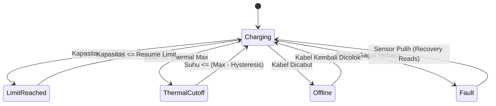
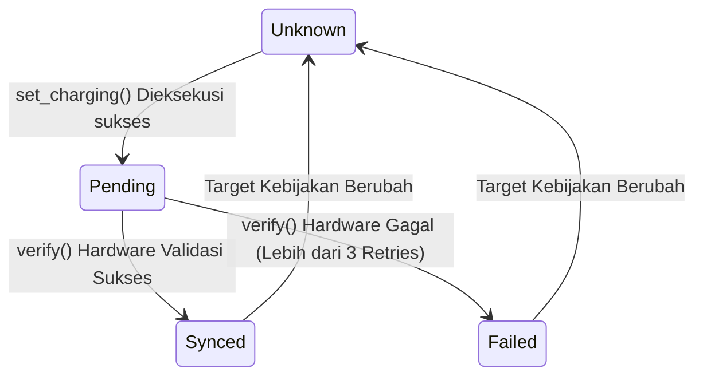

# ChargerControl-rs ⚡

ChargerControl adalah daemon manajemen pengisian daya baterai cerdas untuk perangkat Android (via Root/Magisk) yang ditulis dari nol menggunakan bahasa **Rust**. Daemon ini dirancang sebagai substitusi tangguh untuk berbagai skrip bash *battery-limiter* konvensional, dengan fokus mutlak pada **keamanan hardware**, **ketahanan terhadap crash (resilience)**, dan **pengendalian suhu agresif (thermal safety)**.

Berbeda dengan skrip yang sekadar menulis nilai `0` atau `1` secara brutal ke kernel, ChargerControl-rs dibangun di atas fondasi **State Machine Segregation**. Arsitektur ini memastikan bahwa logika pengambil keputusan (*Policy*) terisolasi dari proses eksekusi perangkat keras (*Hardware I/O*), memberikan lapisan verifikasi berlapis untuk mencegah perangkat gagal mengisi daya atau panas berlebih.

---

## ✨ Fitur Utama

- **Smart Charge Limit dengan Hysteresis**: Menghentikan pengisian daya otomatis pada persentase maksimal (misal: 80%) dan tidak akan melanjutkannya sampai daya turun ke batas *resume* (misal: 75%).
- **Thermal Cutoff Protection**: Pengaman lapis kedua. Menghentikan pengisian daya seketika jika suhu baterai menyentuh ambang batas aman (misal: 42°C), dan hanya melanjutkannya setelah baterai mendingin.
- **Atomic Persistent Ownership (Crash-Proof)**: Fitur pelindung dari pembunuhan proses paksa (SIGKILL/Kernel Panic). Daemon merekam *state* asli hardware sebelum memanipulasinya, menyimpannya di file persisten secara atomik (via berkas `.tmp`), dan akan merestore status tersebut secara mutlak begitu daemon bangkit kembali.
- **Adaptive Scheduler (Smart Polling)**: Meminimalkan penggunaan CPU (*battery friendly*) dengan memprediksi ETA (*Estimated Time of Arrival*) limit berdasarkan kalkulasi **Exponential Moving Average (EMA)** kecepatan persentase dan suhu. Daemon hanya bangun dari tidur di momen krusial.
- **Trailing Debounce Netlink**: Merespons perubahan status colokan kabel langsung dari event `power_supply` ruang Kernel secara *event-driven*, dikombinasikan dengan teknik *trailing debounce* untuk mencegah interupsi berlebih.

---

## 🏗️ Struktur Proyek (Monorepo Workspace)

Proyek ini dibangun sebagai Cargo Workspace yang terdiri dari beberapa *crate*:

1. **`charger-core`**: Berisi fondasi pustaka (*library*). Memuat skema konfigurasi (`schema.rs`), manajemen kesalahan pusat (`error.rs`), definisi node sysfs untuk baterai (`nodes.rs`), dan logika pembacaan/penulisan langsung ke kernel.
2. **`charger-daemon`**: Binary inti (Service). Menjalankan loop utama yang mengelola status pengisian, mendengarkan *IPC*, merespons *Netlink*, dan memantau suhu baterai.
3. **`charger-ctl`**: *Command-Line Interface* (CLI). Digunakan oleh pengguna (atau via aplikasi GUI Android) untuk mengirimkan sinyal IPC ke daemon untuk membaca status *live*, memulai ulang, atau me-reload konfigurasi tanpa mematikan layanan.
4. **`magisk-module`**: Templat modul Magisk siap pakai untuk membungkus binary Rust agar dapat di-*flash* ke dalam Android OS.

---

## 🧩 Arsitektur & Komponen Inti Daemon

Arsitektur utama berada di `crates/charger-daemon/src/monitor/mod.rs`. Seluruh subsistem berjalan sinkron dalam sebuah **Monitor Loop**:

```mermaid
graph TD
    Kernel[Kernel / Sysfs / Uevent] -->|Battery Sensors| Reader(CachedReader)
    Kernel -->|AF_NETLINK| Netlink(NetlinkMonitor)
    
    Reader --> Snapshot{SensorSnapshot}
    Netlink --> Snapshot
    
    Snapshot --> DE[DecisionEngine <br> <b>Safety Authority</b>]
    DE -->|HardwareTarget| HW[HardwareController <br> <b>Hardware Executor</b>]
    
    Snapshot --> Sched[AdaptiveScheduler <br> <b>Wake-up Optimizer</b>]
    Sched -->|Sleep Timeout| Loop(Monitor Loop via <b>poll()</b>)
    
    HW -->|set_charging| Kernel
    HW -->|Atomic Rename| Storage[(ownership.state)]
```

### 1. DecisionEngine (Safety Authority)
Otak utama yang menentukan kebijakan (*policy*) charging. **Engine ini murni konseptual dan dilarang menyentuh sysfs (hardware) secara langsung.**
- Memproses `SensorSnapshot` dan membaca `Config`.
- Menghasilkan keputusan final yang disebut `HardwareTarget` (`ChargingEnabled`, `ChargingDisabled`, atau `Unmanaged`).
- **Conservative Sensor Policy**: Jika hardware sensor tidak merespons (`online == None` atau `capacity == None`), ia tak mengabaikannya, melainkan otomatis masuk ke mode darurat (`SensorFault`) dan memblokir daya.

### 2. HardwareController (Hardware Executor)
Lengan mekanik daemon yang diinstruksikan oleh *DecisionEngine*.
- **Desired vs Applied Target**: Saat menerima perintah, ia menyimpan perintah tersebut ke `desired_target`. Setelah kernel memverifikasi dan merespons penulisan tanpa gagal, barulah ia mengubah status menjadi `applied_target`.
- **Write-Verify Pipeline**: Setelah instruksi sysfs ditulis, controller meminta verifikasi (*Delayed Verification*) beberapa milidetik setelahnya untuk memastikan nilai kernel benar-benar berubah, menangkal bug dimana sysfs di-reset oleh sistem bawaan OS.
- **Ownership Management**: Bertanggung jawab penuh membaca *Original State* dan membakarnya ke disk sebelum daemon ikut campur mengatur kernel.

### 3. AdaptiveScheduler (Wake-up Optimizer)
Alih-alih bangun tiap 1 detik seperti skrip bash tradisional yang menguras CPU, `AdaptiveScheduler` menggunakan turunan kalkulus ringan.
- Ia membandingkan `SensorSnapshot` antar rentang waktu, menghitung derivatif `% kapasitas/detik` dan `suhu/detik`, lalu memuluskannya via *Exponential Moving Average (EMA)*.
- Daemon kemudian menebak: *"Oh, kecepatan isi daya 1% per menit, limit 80%, sekarang 50%. Tidur saja selama 15 menit."*
- **Hard Safety Bounds**: Meskipun sistem tertidur, jika baterai berjarak < 3°C dari batas ledakan/cutoff (misal limit 42°C, sekarang 39.5°C), EMA diabaikan dan sistem dipaksa bangun maksimal setiap **5 detik** (*failsafe* mutlak).

### 4. NetlinkMonitor (Event Listener)
Penerjemah uevent. Daripada mendeteksi *charger dicabut* dengan cara mengecek terus-menerus, ia mengikat soket `AF_NETLINK`. Kernel yang akan mengirimkan paket interupsi bila kabel USB dicabut/dicolok. Daemon cukup terbangun dari `poll()` seketika. Sistem dibumbui dengan *Trailing Debounce* (250ms) agar rentetan notifikasi kabel longgar tak memicu pemborosan kalkulasi.

---

## 🔄 State Machines (Mesin Status Mendalam)

### A. ChargePolicyState (Level: Logika Keputusan)
Menentukan status logis dari sesi pengisian saat ini. Mesin status ini dievaluasi murni secara *stateless* di setiap siklus.



**Offline Freeze**:
Berbeda dengan aplikasi sejenis yang melepas kontrol baterai ke pabrikan ketika dicabut, status `Offline` pada Daemon ini **mempertahankan** (*freeze*) `HardwareTarget` terakhirnya. Ini memastikan limit 80% tidak kebobolan menjadi 81% saat pengguna tak sengaja mencabut-colok kabel.

### B. SyncState (Level: Integritas Perangkat Keras)
Siklus per-tugas di `HardwareController`.


> **Failsafe**: Bila mesin terjebak pada status `Failed` karena sysfs bermasalah, scheduler otomatis akan dipaksa bangun paksa per 2 detik tanpa harus menunggu prediksi EMA.

### C. Ownership & Recovery
Daemon menganut paham mutlak: *"Kembalikan hardware Android seperti semula ketika kita mati"*.

1. Saat daemon pertama kali beranjak dari `Unmanaged` dan mengubah status kernel, ia membaca sysfs terlebih dahulu dan menyimpannya (misal: "Awalnya Aktif"). Ia lalu menuliskannya ke `/data/adb/charger-control/ownership.state` via file temporary dan *atomic rename*.
2. Apabila daemon dimatikan dengan wajar (`SIGTERM`) atau di-disable dari config, ia akan merestore status kernel kembali Aktif, menghapus file `ownership.state`, dan mengubah status ke `NotOwned`.
3. **Crash Recovery (Anti-SIGKILL)**: Jika OS membunuh daemon (kehabisan RAM) atau HP mati mendadak, file `ownership.state` tidak terhapus (stale). Pada siklus boot-up *start*, daemon melihat file ini ada. Ia langsung memanipulasi hardware memulihkannya ke keadaan semula sebagai tindakan preventif P0, menghapus file tersebut, barulah ia memulai *monitor loop* yang baru.

---

## 💻 IPC (Inter-Process Communication) & Hot-Reload

Komunikasi antara `charger-ctl` (User) dan `charger-daemon` terjadi melalui soket UNIX Datagram non-blocking (`/data/adb/charger-control/daemon.sock`).

Terdapat kombinasi pemantauan ganda pada OS syscall `poll()`, yang mengawasi:
1. `rx.as_raw_fd()`: Soket IPC dari User.
2. `netlink.as_raw_fd()`: Soket uevent dari Kernel.

Saat User memberikan instruksi via `charger-ctl reload` (Sinyal byte `[1]`), `poll()` otomatis pecah, *Monitor Loop* dipaksa melakukan evaluasi ulang terhadap `Config` dari disk saat itu juga tanpa mematikan proses OS, me-reset seluruh EMA scheduler untuk membaca perubahan batas suhu/limit yang baru, dan langsung menyesuaikan perangkat keras dalam milidetik yang sama.

---

## 📂 Lokasi Direktori Sistem

Daemon bergantung penuh pada partisi `/data/adb/` yang dilindungi hak askses *root*:

- **Konfigurasi Utama**: `/data/adb/charger-control/config.toml`
- **Log Histori**: `/data/adb/charger-control/charger-control.log` (Rotasi otomatis / *Synchronous File Logging*)
- **Single-Instance Lock**: `/data/adb/charger-control/daemon.lock` (Mencegah dua daemon mengatur hardware yang sama)
- **Persistent Ownership**: `/data/adb/charger-control/ownership.state`
- **IPC Socket**: `/data/adb/charger-control/daemon.sock`
